# SVO Raytracer

A raytracer based on SVO / SVDAG, rendered with OpenGL and Compute Shader

## Features
* colors
* accumulation buffer
* SVO
* SVDAG
* perlin-noise based procedural terrain generation
* reflection, refraction for water
* diffuse surface
* gamma correction
* directional light
* anti-aliasing
* depth of field

## Screenshots

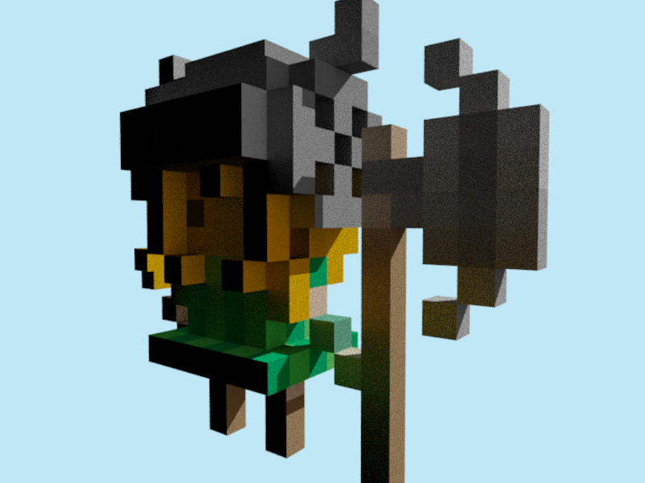
Model from MagicaVoxel (`chr_knight.vox`)

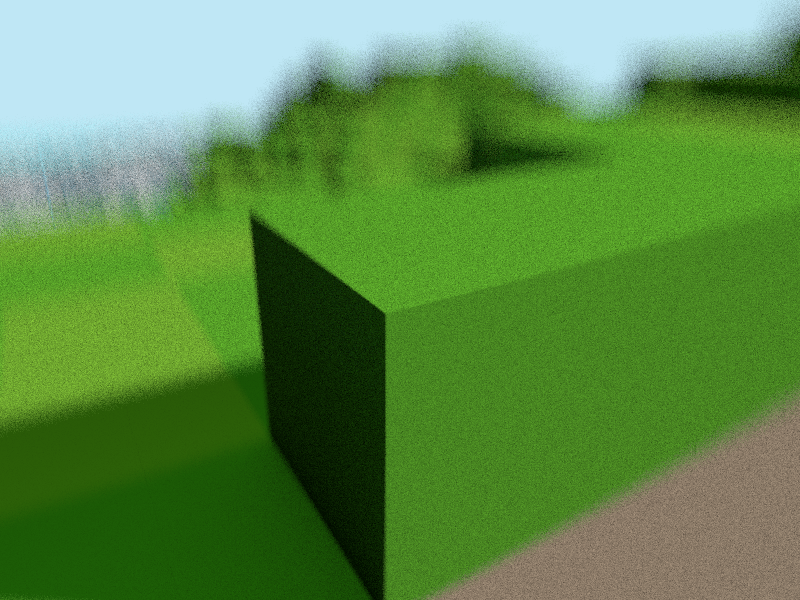
Depth of field

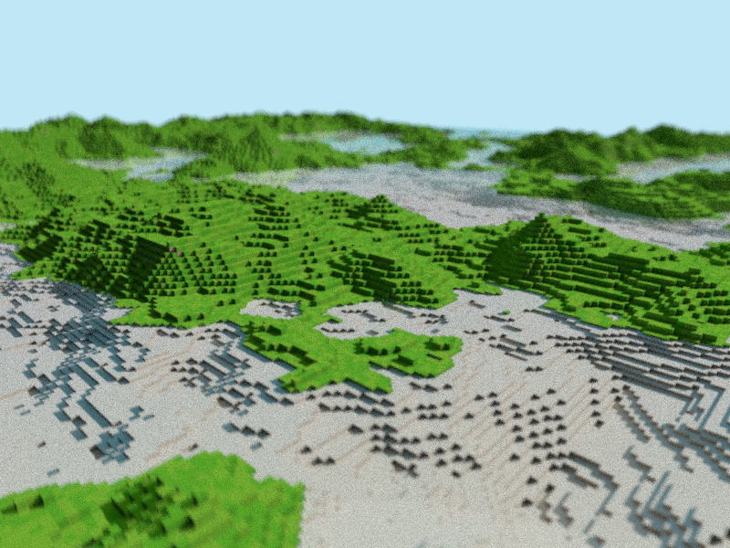
Perlin-noise generated terrain

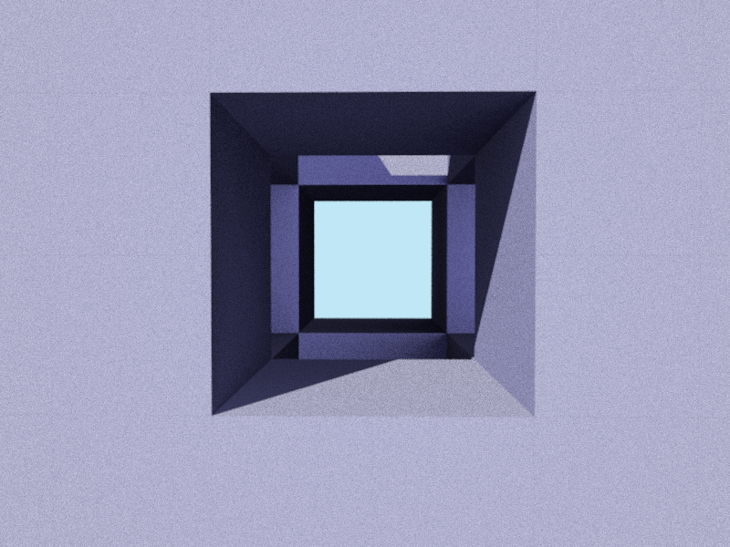
Model from MagicaVoxel (`3x3x3.vox`)

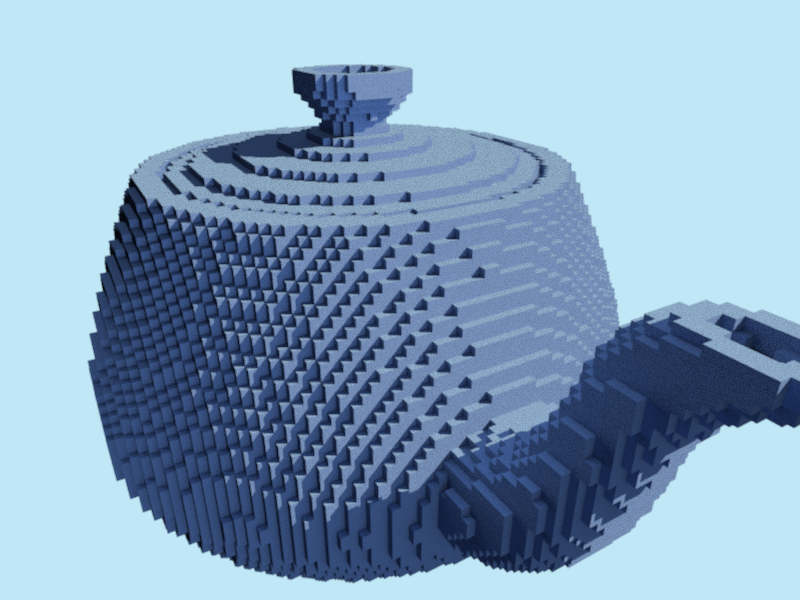
Model from MagicaVoxel (`teapot.vox`)

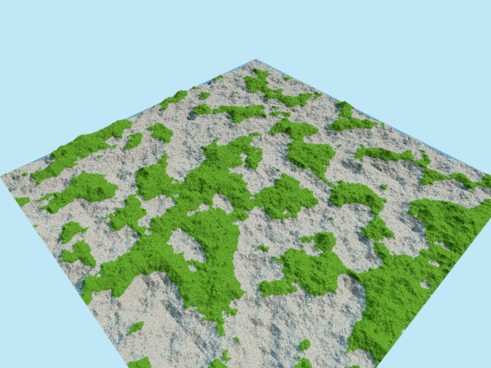
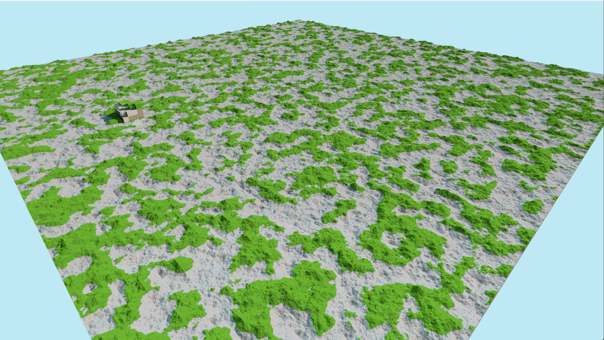
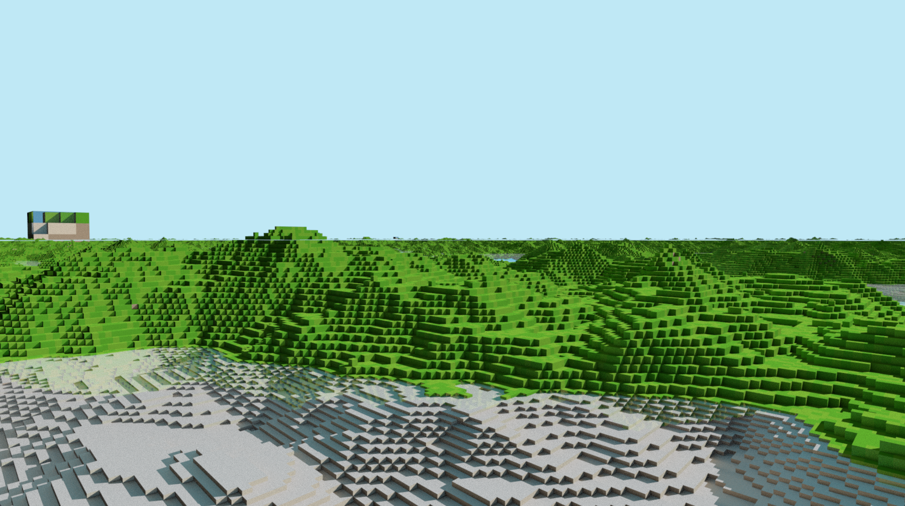
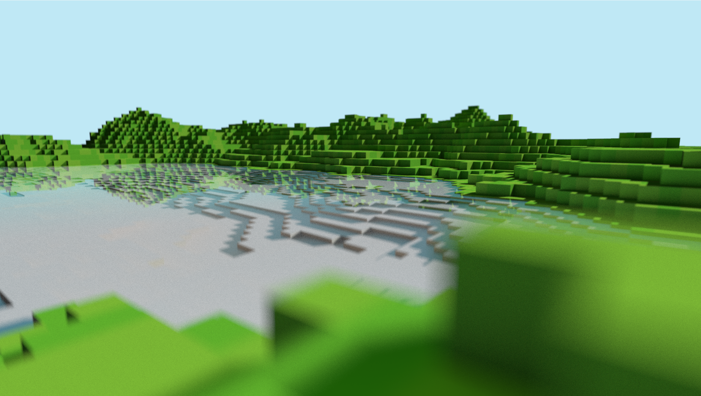
Perlin-noise procedually generated terrain

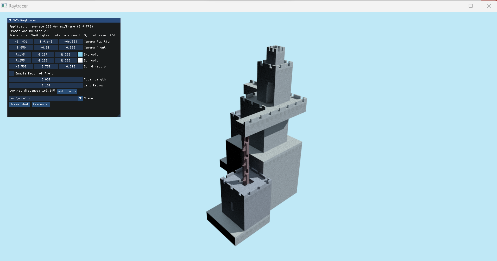
GUI made with imgui. Model from Magicavoxel (`monu1.vox`)

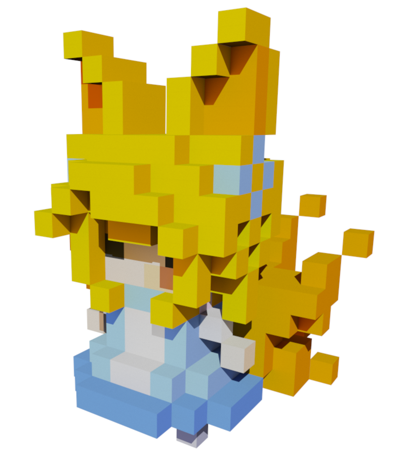
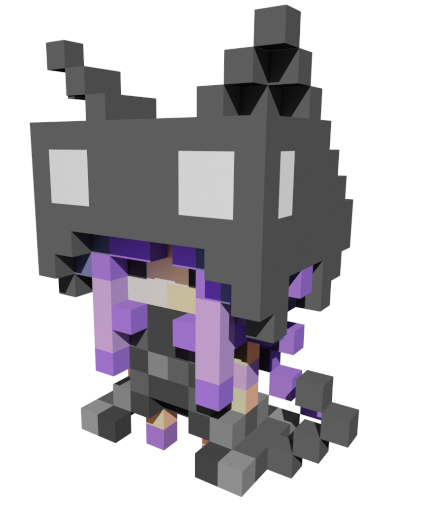
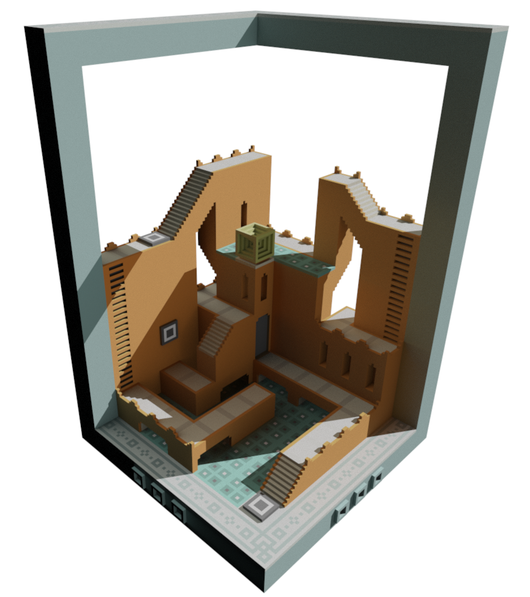
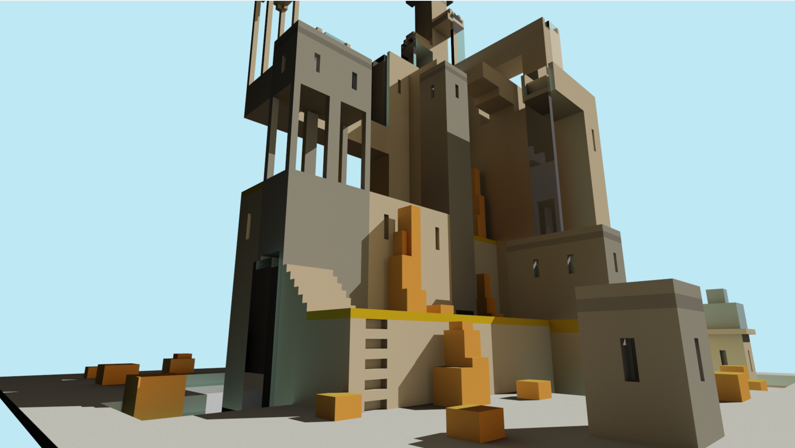
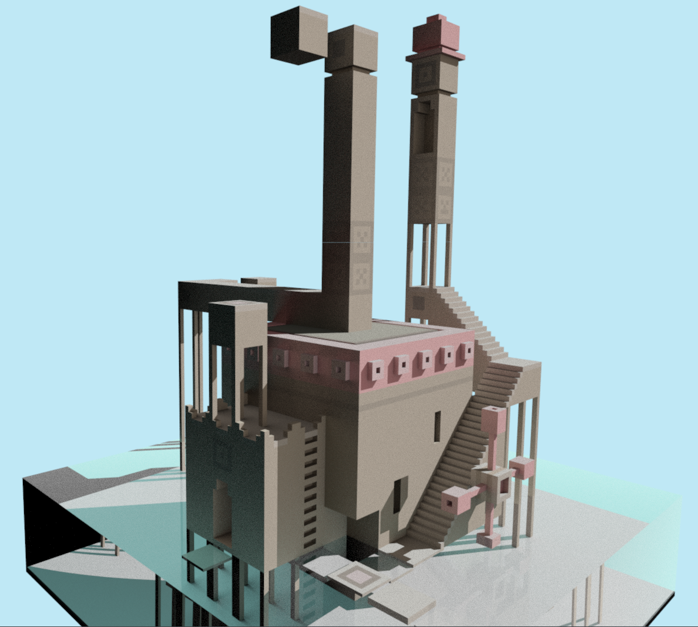
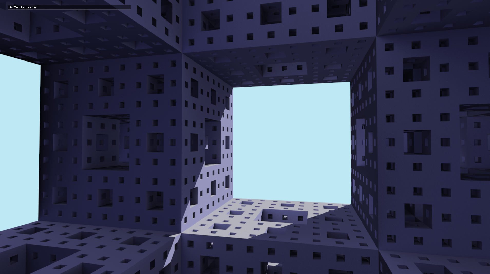
Model by ephtracy

## Building

Theoretically support multiple platforms, but only tested on Windows 11 with Visual Studio 2022.
Open `raytracer_win.sln` and compile. You might need to install all the dependencies.

## Dependencies
* [GLFW](https://www.glfw.org/)
* glad
* glm
* [imgui](https://github.com/ocornut/imgui) for GUI
* [stb_image_write](https://github.com/nothings/stb/blob/master/stb_image_write.h) for writing .png screenshots
* [ogt_vox](https://github.com/jpaver/opengametools/blob/master/src/ogt_vox.h) for reading .vox model files

## Implementations
The project can generate SVO from Magicavoxel `.vox` files, or procedually generate it with perlin noise. Then it will be converted to SVDAG. The conversion code is not fully optimized and might take a lot of memory, but the generated SVDAG is usually very small even for a large scene. It is then possible to load the generated svdag directly to save time if you wish.

SVDAG [1] is a modified version of SVO in that it is a DAG instead of a tree. This project uses a custom version of SVDAG with structure defined below.
```
        ┌──────────────────────────┬────────┐
byte 1  │   material id            │ bitmask│
        │   24 bits                │  8-bits│
        ├──────────────────────────┴────────┤
        │                                   │
byte 2  │   index of the child node n1      │
        ├───────────────────────────────────┤
        │                                   │
byte 3  │   index of the child node n2      │
        ├───────────────────────────────────┤
        │                                   │
        │             ........              │
        └───────────────────────────────────┘
```

The bitmask is used to indicate which child nodes are valid. For example, if the bitmask is `0b00000101`, then the first two child nodes are valid. If the bitmask is `0b00000000`, then there is no child node, which means that the node is filled, and is the unit voxel. An empty voxel is represented by 0 in the bitmask of the parent node. The bitmask is stored in the first byte of the node, along with the material id, which is an index of the corresponding material in the material list. This makes it capable of storing $2^{24}=16777216$ different materials.

Followed by the first byte of the node, there will be `n`
more bytes each being the index of where the child node is located, where `n` is the number of `1` bit in `bitmask`.

The following graph demonstrates the mapping from the bit `1<<i` to the octant `i` of the node.


Then the entire SVDAG and the list of material is sent to GPU for rendering. The main rendering is done with compute shader and OpenGL, implemented in `shaders/compute.glsl`. This compute shader will render the screen to a quad texture. Defined at the beginning are some of the constants that can be adjust, such as
* `MAX_BOUNCE`: max number of time a light can bounce
* `MAX_RAYTRACE_DEPTH`: max number of node can be tranversed to find the intersected node
* `DIFFUSION_PROB`: probability where the light will stop instead of keep bouncing. `DIFFUSION_PROB=1` means light does not bounce over diffuse surface.
More options such as sky color, DOF, etc. can be adjusted in the app's GUI. Those are passed in as uniform.

Once you open the app, it will keep render the same image, accumulating the result and mixing it with previous frames, effectively giving multiple samples per pixel, reducing noises. Once you move the camera or change any settings, the frame will be cleared and a new frame will be rendered from scratch. Press WASD to move the camera around, press X or/and C to accelerate movement.

Anti-alising and DOF are both implemented by disturbing the ray origin by a small and random value. Gamma correction is implemented in `fragment.glsl` and also when storing the screenshot.

## Issues
Auto-focus and screenshots may not work on some computers.

## Objectives 

Here is the list of objectives listed in the proposal.
All of them are completed.

1. Colors being rendered with compute shader
2. Generate SVO and SVDAG in CPU
3. Render a sample scene with SVO/SVDAG
4. Support color and different materials
5. Ray tracing with GPU, including directional
light and reflection for diffuse surface with importance sampling
6. Add reflection and refraction for water; support
supersampling and gamma correction.
7. Procedurally generate voxel world terrain and
import existing scenes
8. Depth of field supports


## Attributions
* The main data structure SVDAG is modified from
> [1] V. Kämpe, E. Sintorn, and U. Assarsson,
“High resolution sparse voxel dags,” *ACM
Trans. Graph.*, vol. 32, no. 4, 2013, doi:
10.1145/2461912.2462024.
* Perlin noise terrain generation code is adatped from [NEWorld](https://github.com/Infinideastudio/NEWorld/blob/0.5.0/NEWorld.Game/Universe/World/TerrainGen/Noise.h), a video-game project I worked on before, licensed under LGPLv3.
* This project is inspired from [vxrt](https://github.com/bridgekat/vxrt), licensed under WTFPLv2. I adapted its shader PRNG (pseudo-random number generator) code.
* [glsl-square-frame](https://github.com/hughsk/glsl-square-frame/tree/master): Given a screen size, get values between -1 and +1 for the current pixel. Small GLSL util licensed under MIT.
* [glsl-look-at](https://github.com/glslify/glsl-look-at): Generates a 3D lookAt matrix in GLSL. Small GLSL util licensed under MIT.
* [glsl-camera-ray](https://github.com/glslify/glsl-camera-ray): Generates a ray for Shadertoy-style raycasting in GLSL. Small GLSL util licensed under MIT.
* `vox` folder contains models from [MagicaVoxel](https://ephtracy.github.io/), [vox-models](https://github.com/kluchek/vox-models), [Celebration_6000](https://sketchfab.com/3d-models/cake-time-105bf50b62364bd98beafa60a858f898#download), [ephtracy/voxel-model](https://github.com/ephtracy/voxel-model/tree/master), [mikelovesrobots/mmmm](https://github.com/mikelovesrobots/mmmm).

## License
GPLv3 License

